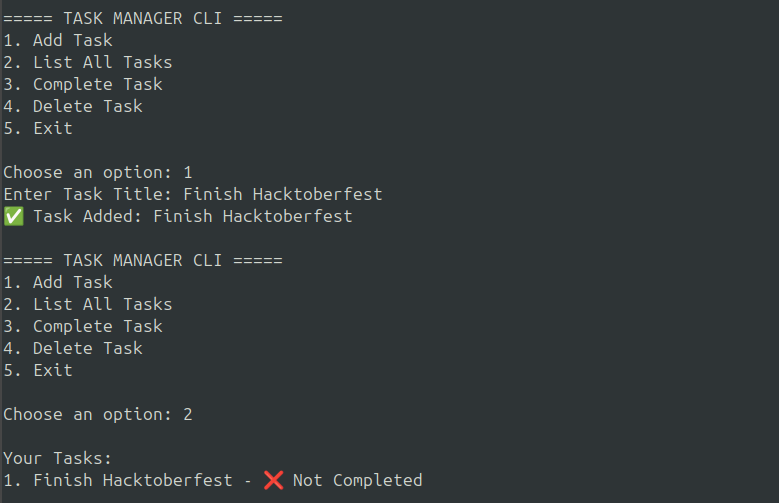

## 📝 Task Manager CLI

A Simple CLI Task Manager created in Python.

Easily add, view, complete, and delete tasks — all stored locally in a <b> tasks.json </b> file.

## Features

- Add new tasks.
- View all tasks.
- Marks tasks as completed.
- Delete tasks
- Automatically saves data in JSON file.

## How to run

1. Make Sure Python3 is installed on your system.

```bash
    python3 --version
```

2. Run the script : 
- You don’t need to install anything! Just open your terminal inside the project folder and run

```bash
    python3 task_manager.py
```

3. Follow the menu : 

```bash 
    ===== TASK MANAGER CLI =====
    1. Add Task
    2. List All Tasks
    3. Complete Task
    4. Delete Task
    5. Exit
```

<b> Just type the number to perform any action ✅. <b>

## Example



## Additional Information
- This project is ready for change — you can enhance it, fix bugs, or add new ideas!
